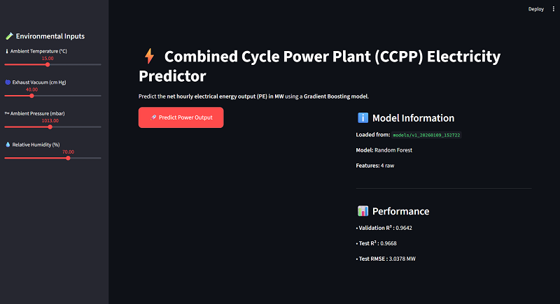

# 🏭 Power Plant Electricity Energy Output Predictor

[](https://www.python.org/)
[](https://scikit-learn.org/)
[](https://mlflow.org/)


---

## 📋 Table of Contents

- [Overview](#overview)
- [Dataset](#dataset)
- [Methodology](#features)
- [Project Structure](#project-structure)
- [Usage](#usage)
- [Model Performance](#model-performance)
- [Technical Details](#technical-details)
- [Results](#results--visualizations)

---

## 🎯 Overview

This project focuses on predicting the net hourly electrical energy output (PE) of a combined cycle power plant (CCPP) using machine learning. The dataset contains 9,568 hourly operational records with 4 environmental features and 1 target variable.
The goal is to build a robust and reproducible regression pipeline to model the relationship between ambient conditions and power output, with an emphasis on production-ready ML workflows, experiment tracking, and scalability. The final model is deployed as an interactive Streamlit web application, allowing operators to input environmental conditions and receive real-time power output predictions.

### Key Highlights

- **Advanced Feature Engineering**: Domain-driven features based on thermodynamic principles
- **Comprehensive Model Comparison**: 8 regression models evaluated systematically
- **Hyperparameter Optimization**: RandomizedSearchCV with 20+ iterations per model
- **Production-Ready Pipeline**: Modular preprocessing with robust outlier handling
- **Experiment Tracking**: Full MLflow integration for reproducibility
- **Interactive UI**: Streamlit dashboard for real-time predictions

---

## 📊 Dataset

### Combined Cycle Power Plant (CCPP) Dataset

- **Source**: UCI Machine Learning Repository
- **Samples**: 9,568 hourly measurements
- **Period**: 6 years of operational data (2006-2011)
- **Features**: 4 environmental variables
- **Target**: Net hourly electrical energy output (MW)

### Feature Descriptions

| Feature | Description | Unit    | Range |
|---------|-------------|---------|-------|
| **AT** | Ambient Temperature | °C      | 1.81 - 37.11 |
| **V** | Exhaust Vacuum | cm Hg   | 25.36 - 81.56 |
| **AP** | Ambient Pressure | milibar | 992.89 - 1033.30 |
| **RH** | Relative Humidity | %       | 25.56 - 100.16 |
| **PE** | Power Output (target) | MW      | 420.26 - 495.76 |

---
## 🧠 Methodology


### 1. Robust Preprocessing Pipeline - Custom Transformers
To ensure the pipeline is production-ready, custom classes were built:
- **AdvancedFeatureEngineer**: Automatically generates physics based features for new data points.
- **OutlierHandler**: Dynamically clips outliers based on IQR thresholds during inference.
- **Scaling**: RobustScaler for outlier resistance
- **Modular Design**: Sklearn-compatible transformers

### 2. Model Arsenal

Evaluated 8 regression models:

1. Linear Regression (baseline)
2. Ridge Regression (L2 regularization)
3. Lasso Regression (L1 regularization)
4. ElasticNet (L1+L2 hybrid)
5. **Random Forest** (ensemble) ⭐
6. **Gradient Boosting** (sequential learning) 
7. Support Vector Regression (kernel method)
8. Voting Ensemble (meta-ensemble)

### 3. Automated Hyperparameter Tuning

- **Method**: RandomizedSearchCV
- **Search Space**: 100+ parameter combinations per model
- **Cross-Validation**: 5-fold stratified CV
- **Best Model**: Random Forest (tuned)

### 4. MLflow Experiment Tracking

All experiments automatically logged:
- Model hyperparameters
- Training/validation metrics
- Cross-validation scores
- Model artifacts
- Preprocessing pipelines

---

## 📁 Project Structure

```
power-plant-predictor/
│
├── Data/
│   └── Power Plant Data.csv
│      
├── notebooks/
│   └── Power Plant.ipynb         
│
├── src/
│   ├── feature_engineering_class.py
│   ├── preprocessor.py               
│   ├── train.py                   
│   ├── evaluate.py                   
│   └── visualizations.py
│
├── UI_image/
│   └── Screenshot.png
│
├── config.py
├── eda.py              
├── app.py 
├── requirements.txt               
├── README.md   
└── .gitignore                
```

---

### Setup

1. **Clone the repository**

```bash
git clone https://github.com/yourusername/power-plant-predictor.git
cd power-plant-predictor
```

2. **Create virtual environment** (recommended)

```bash
python -m venv venv
source venv/bin/activate  # On Windows: venv\Scripts\activate
```

3. **Install dependencies**

```bash
pip install -r requirements.txt
```

---

## 💻 Usage

### 🚀 Make Predictions using Streamlit UI

```bash
streamlit run app.py
python -m streamlit run app.py
```

Access the interactive dashboard at `http://localhost:****`


---

## 📈 Model Performance

### Final Results (Test Set)

| Metric | Value         |
|--------|---------------|
| **R² Score** | **0.9668**    |
| **RMSE** | **3.0378 MW** |
| **MAE** | **2.2161 MW** |

## Feature Engineering Evaluation

The model trained again after an addition of 3 physics based features
and comparing the results :

|             Setup              |        Best Model        | Validation R² |  Test R²   |
|:------------------------------:|:------------------------:|:-------------:|:----------:|
|      Train with Engineered Features   |    Gradient Boosting     |    0.9625     |   0.9636   |
| Train with Raw Features |      Random Forest       |    0.9642     |   0.9668   |

Tree based models were able to capture nonlinear relationships directly from the raw physical
features. Additional engineered features introduced redundancy and did not improve generalization.
Therefore, the final deployed model uses only the original four environmental variables.

### Key Insights

✅ **Random Forest** achieved the best performance after tuning  
✅ **Low overfitting**: Train-Val gap < 0.033 for all top models  
✅ **Stable predictions**: Low CV standard deviation (max 0.0052)\
✅**Key predictors:** Ambient Temperature (AT) and Exhaust Vacuum (V) show strong correlation with power output
---

## 🔧 Technical Details

### Feature Engineering Process

1. **Saturation Vapor Pressure** (Magnus Formula):
   ```
   P_sat = 6.112 × exp((17.67 × AT) / (243.5 + AT))
   ```

2. **Actual Vapor Pressure**:
   ```
   P_v = P_sat × (RH / 100)
   ```

3. **Engineered Features**:
   - Air Density: `AP / (AT + 273.15)`
   - Moisture Mole Fraction: `P_v / AP`
   - Dry Mass Flow Index: `(AP - P_v) / (AT + 273.15)`

### Best Model Configuration

**Random Forest Regressor Hyperparameter Grids (Tuned)**

```python
RandomForestRegressor(
    n_estimators=300,
    learning_rate=0.05,
    min_samples_leaf=1,
    min_samples_split=2,
    max_features=log2,
    max_depth=None
)
```

---

## 📊 Results

### Feature Correlations

Strong predictors identified:
- **AT (Ambient Temp)**: -0.95 correlation with PE
- **V (Exhaust Vacuum)**: -0.87 correlation with PE
- **DryMassFlowIndex**: +0.95 correlation with PE 

### Model Insights

1. **Temperature Dominance**: Ambient temperature is the strongest predictor
2. **Nonlinear Relationships**: Tree based models outperform linear models
3. **Feature Interactions**: Ensemble methods capture complex dependencies

---

### ✍️ Author

**Mohanad Ahmed (Mo. A)**

🔗LinkedIn: [https://www.linkedin.com/in/mohanad-ahmed01](https://www.linkedin.com/in/mohanad-ahmed01e)

🔗Github: [https://github.com/mohanadcv](https://github.com/mohanadcv)

---
📄 License\
 This project is part of SAIR Sudanese Artificial Intelligence under MIT License
---